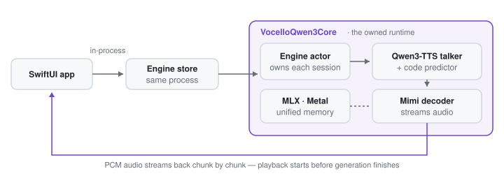

<h1 align="center">Vocello</h1>

<p align="center">
  A local, private voice studio for Apple Silicon. Write a script, choose or shape a voice, and generate speech on your device with native Swift and MLX.<br>
  No account. No credits. Nothing you write or record leaves your device.<br>
  <strong>Available for Mac. The iPhone app is in public beta on TestFlight.</strong>
</p>

<p align="center">
  <a href="https://vocello.vercel.app/"></a>
  <a href="https://github.com/PowerBeef/Vocello/releases/tag/v2.3.0"></a>
  
  <a href="https://testflight.apple.com/join/Cvp6yCv7"></a>
  
  <a href="LICENSE"></a>
</p>

<div align="center">


</div>

<p align="center">
  <a href="https://github.com/PowerBeef/Vocello/releases/download/v2.3.0/Vocello-macos26.dmg"><strong>Download Vocello 2.3.0 for macOS 26+</strong></a><br>
  <a href="https://testflight.apple.com/join/Cvp6yCv7"><strong>Join the iPhone beta on TestFlight</strong></a><br>
  <a href="https://github.com/PowerBeef/Vocello/releases/tag/v2.3.0">Release details</a> · <a href="docs/releases/v2.3.0.md">What is new</a> · <a href="https://github.com/PowerBeef/Vocello/releases">All releases</a>
</p>

<p align="center">
  <em>Write a script, pick or shape a voice, and listen: a native Swift + MLX engine, faster than realtime on an 8&nbsp;GB M2, with nothing leaving your Mac.</em>
</p>


## What Vocello does

- **Custom Voice:** choose one of nine built-in Qwen3 speakers, then set language and delivery.
- **Voice Design:** describe a voice in plain language and generate it from that brief.
- **Voice Cloning:** record or import a reference you have permission to use, affirm consent, and save it to your voice library.

Scripts past 900 characters become **long-form projects**: planned segments stream one after another while you listen along, then join into a single finished file with a per-segment map in History. Ten languages are supported (Chinese, English, Japanese, Korean, German, French, Russian, Portuguese, Spanish, and Italian) with automatic detection, and everything (scripts, references, history, audio) stays in local app storage unless you export it.

Vocello is not a wrapper around a Python server: generation runs through a first-party Swift runtime on MLX, and the full engineering story lives in [Under the hood](#under-the-hood).

## Voice workflows

| Voice Design | Voice Cloning |
| --- | --- |
|  |  |
| Describe character, age, accent, texture, and delivery. Save a successful design as a reusable voice reference. | Record in the app or import WAV, MP3, AIFF, M4A, FLAC, OGG, or WebM. A transcript improves conditioning but is optional. Generation requires the visible consent acknowledgment in Settings; only clone voices you own or are authorized to use. |

Custom Voice and Voice Design support ten delivery styles at subtle, normal, or strong intensity, plus a free-text delivery description. Voice Cloning follows the reference voice and does not expose delivery controls.

| Models | History |
| --- | --- |
|  |  |
| Install and manage the available model package for each voice mode from Settings. | Generations remain local and can be replayed, searched, exported, or removed. |

## Variation and reproducibility

The Expressive, Balanced, and Consistent variation settings trade take-to-take variety against stability. Multi-line batches share one seed so their lines form a consistent performance. CLI and benchmark callers can provide an explicit seed for reproducible evidence. Ordinary interactive generations are not presented as seed-replayable takes.

## Local-first privacy

- Speech generation runs locally after models are installed.
- Generated audio, recorded references, transcripts, saved voices, and history remain in local app storage unless you export them.
- Model installation downloads pinned model artifacts from Hugging Face.
- Reference recording requests microphone access. Transcript auto-fill requests Speech Recognition access and uses on-device recognition with the required system language assets.
- Voice cloning should only be used with voices you own or have permission to use.
- Clone generation remains disabled until its visible consent acknowledgment is enabled in
  Settings; the choice is stored locally and can be changed there.

Storage locations and deletion behavior are documented in [`docs/reference/privacy-storage.md`](docs/reference/privacy-storage.md).

---

## Install on Mac

1. Download [`Vocello-macos26.dmg`](https://github.com/PowerBeef/Vocello/releases/download/v2.3.0/Vocello-macos26.dmg).
2. Open the DMG and drag `Vocello.app` to `/Applications`.
3. Open Vocello, then install models from **Settings > Model downloads**.
4. Generate from Custom Voice, Voice Design, or Voice Cloning.

The current DMG is signed with an Apple Developer ID certificate, notarized, and stapled. The attached [`release-metadata.txt`](https://github.com/PowerBeef/Vocello/releases/download/v2.3.0/release-metadata.txt) records source and toolchain provenance.

Upgrading from an earlier Vocello 2.x does not require reinstalling models; application data remains under `~/Library/Application Support/QwenVoice/`. After updating to 2.3.0, Settings shows an optional in-place update for installed models to the current smaller packages.

With the 2.2.0 release the repository moved from `PowerBeef/QwenVoice` to `PowerBeef/Vocello`; every old link and clone URL redirects to the new name.

## System requirements and model variants

| Platform | Support | Model variants | Public status |
| --- | --- | --- | --- |
| Mac | macOS 26.0 or newer, Apple Silicon, 8 GB RAM minimum | Speed (4-bit) and Quality (8-bit) | Vocello 2.3.0 is available now |
| iPhone | iPhone 15 Pro or newer, iOS 26.0 or newer | Speed (4-bit) | Public beta via [TestFlight](https://testflight.apple.com/join/Cvp6yCv7) |

Speed is the recommended default and uses less memory. Quality is a Mac-only option for machines with more headroom. The three recommended Mac Speed packages total about 6 GB.

Support floors and benchmark machines are different facts: the floor is any Apple Silicon Mac with 8 GB, and canonical evidence is produced on a Mac mini M2 with 8 GB and an iPhone 17 Pro; see [Performance, measured](#performance-measured) below. The canonical record is `passedWithWarnings` because accepted memory soft trims and audio-QC warnings remain visible rather than being hidden; the [tracked record](benchmarks/runs/ui-generation/macos-xcui-benchmark-20260729-023553-111d88c6.json), produced on the current 2026.07.26.1 model packages, has the exact matrix and conditions.

Macs on macOS 15 can use the legacy [QwenVoice 1.2.3 release](https://github.com/PowerBeef/Vocello/releases/tag/v1.2.3). No Vocello 2.x backport is planned.

## Vocello for iPhone

| | |
| --- | --- |
|  | The iPhone app uses the same local Qwen3-TTS and MLX foundation with an iPhone-specific in-process runtime. It provides Custom Voice, Voice Design, Voice Cloning, recording and Files import, local history, and the memory-conscious Speed models. On-device generation, physical-iPhone XCUITest, and an optional signed archive/TestFlight lane are implemented. A fresh full multilingual physical-iPhone run passed all 19 hint/QC and 18 output gates with policy-accepted warnings; its exploratory record is excluded from clean performance trends. A public TestFlight beta is open: [join here](https://testflight.apple.com/join/Cvp6yCv7). App Store distribution remains a separate maintainer-owned release decision. |

Current implementation and acceptance status: [`docs/development-progress.md`](docs/development-progress.md).

---

## Under the hood

This is the maintained engineering record of the whole package, refreshed with each release. Every claim below traces to a tracked benchmark record, a machine-readable contract, or a documented measurement in this repository.

### The owned runtime

Most local TTS tools shell out to a Python reference implementation behind a local server. Vocello generates through a first-party Swift runtime on MLX, [`VocelloQwen3Core`](Packages/VocelloQwen3Core/README.md): no Python, no local server, no bundled weights. The runtime is derived from [`mlx-audio-swift`](https://github.com/Blaizzy/mlx-audio-swift) v0.1.2 and narrowed to exactly what Vocello ships, the Qwen3-TTS runtime and the Mimi codec primitives it needs: about 36,000 of roughly 49,000 upstream lines were removed in that specialization, and the 83 retained files (37 identical, 21 modified, 25 added) plus 14 named semantic changes are tracked under an immutable lineage ledger (`Packages/VocelloQwen3Core/PATCHES.json`). A facade contract rejects any public declaration that leaks raw MLX types, and benchmark-backed capability claims automatically demote when their evidence source drifts from the recorded run.

One engine serves three hosts. On the Mac the engine lives in a separate XPC service process that retires when idle, so engine memory pressure can never take the app window down, and retiring the process returns memory that a model unload alone cannot. On iPhone the same engine runs in-process. The `vocello` command-line tool links the engine directly and reuses the models the app installed.

<picture>
  <source media="(prefers-color-scheme: dark)" srcset="docs/charts/architecture-dark.svg">
  
</picture>

Every request moves through one synthesis pipeline from conditioning to a verified 24 kHz mono 16-bit WAV, owned end to end by an engine actor. The full request lifecycle and engine invariants are documented in [`docs/ARCHITECTURE.md`](docs/ARCHITECTURE.md).

### Streaming, memory, and determinism

Long scripts do not need a bigger Mac. Audio crosses an actor-owned, frame-bounded channel chunk by chunk: audio-bearing events are never dropped, backpressure suspends the producer instead of buffering, and cancelling a suspended producer is proven by test to wake it cleanly. Making streaming the default collapsed peak generation memory from about 8 GB to about 3 GB on the same take and made the peak flat with output length, a measurement that overturned the project's own earlier analysis (`benchmarks/OPTIMIZATION.md` §F.1). A 12-segment long-form project producing 10.4 minutes of audio ended about 1.1% below its starting footprint:

<picture>
  <source media="(prefers-color-scheme: dark)" srcset="docs/charts/longform-memory-dark.svg">
  
</picture>

Takes are reproducible by construction: every request carries its own seed and fresh sampler state, nothing samples from process-global state, and cancellation is a typed, awaited operation (user, memory pressure, superseded, or shutdown), so a cancelled take can never land in History. Memory policy is set per device tier, with no hard memory cap in production and no silent quality fallback.

### Performance, measured

Every number below comes from a tracked, privacy-safe benchmark record in this repository; canonical evidence is produced on the support-floor tier, a Mac mini M2 with 8 GB.

<picture>
  <source media="(prefers-color-scheme: dark)" srcset="docs/charts/rtf-by-mode-dark.svg">
  
</picture>

That speed is the sum of an evergreen optimization ledger, not one trick. Section letters cite `benchmarks/OPTIMIZATION.md`:

- The workload proved launch-bound, not compute-bound: whole-generation GPU busy rose from 31 to 37% up to about 49% as host-side graph building was removed, and that characterization has steered every optimization since (§H, §M).
- A fused code-predictor rotary embedding removed about 600 kernel launches per frame, worth +26% warm; this is the change that took the 8 GB floor Mac past realtime (§H P3).
- The per-frame code-predictor pass is compiled once and replayed, worth +8 to 11% warm on every cell with byte-identical output (§M P3).
- Stream-chunk materialization is pipelined off the token hot path with identical event order, verified byte-identical across 12 of 12 fixed-seed takes (§M P2a-i).
- Switching models reuses the byte-identical 682 MB speech tokenizer: its load cost drops from 503 ms to zero (§N 2.1).
- The model packages carry 8-bit text embeddings, about 278 MB less resident memory and 292 MB less disk per Speed package, published across six public Hugging Face repositories at verified equal quality (§N 2.2).
- The interface steps aside while the engine works: attribution put window compositing near 23% of the same warm take against about 3% for XPC transport, so translucent surfaces render as solid fills during generation (§K).

The full methodology, hardware profiles, and every published record live in [`benchmarks/HISTORY.md`](benchmarks/HISTORY.md) and [`docs/reference/benchmarking-procedure.md`](docs/reference/benchmarking-procedure.md); the charts in this section regenerate deterministically from the named records via `scripts/generate_readme_charts.py`.

### Honest measurement

Performance work here merges only with proof. Fixed-seed byte-identity is the merge gate for scheduling changes (a change that moves a single sample is not a scheduling change), and the losses are recorded next to the wins: experiments that regressed are kept as measured do-NOTs with their numbers, and a whole conversion arm was parked when its regression reproduced across data types (`benchmarks/OPTIMIZATION.md` §M, §N 2.3). The benchmark lane once caught its own observer effect, a +55% swing traced to the test harness video-encoding the screen during UI benchmarks, and the affected records are marked non-comparable rather than quietly deleted (§J). Published benchmark records are PASS-only and privacy-allowlisted by design, and every take carries a typed quality identity (audio, prosody, transcription, and continuity gate verdicts) in the registry schema.

Vocello is built by a solo developer with heavy use of coding agents. Every performance claim above is gated by deterministic, fixed-seed checks and the tracked benchmark records in this repository.

## Build from source

Building requires **full Xcode 26** on an Apple Silicon Mac running macOS 26 or newer; the
Command Line Tools alone are not enough, even for the CLI, because every product (app and
`vocello`) is a target of the generated Xcode project. If `xcodebuild` reports the active
developer directory is a Command Line Tools instance, point it at Xcode:
`sudo xcode-select -s /Applications/Xcode.app/Contents/Developer`. Validation scripts run with
the system `python3` (any currently supported Python version).

```sh
git clone https://github.com/PowerBeef/Vocello.git
cd Vocello
./scripts/regenerate_project.sh
./scripts/build.sh build
```

Repository scripts are the authoritative build and test interface. `project.yml` generates the Xcode project, so edit it instead of the generated project file. To work in Xcode after generation, open `QwenVoice.xcodeproj`.

Generated native output is governed by [`config/build-output-policy.json`](config/build-output-policy.json): persistent platform caches live under `build/cache/`, temporary builds under `build/scratch/`, evidence and current symbols under `build/artifacts/`, and distribution products under `build/dist/`. The same contract owns child-result retention and free-space floors for heavy lanes, so a low-space run stops before creating another partial cache or result. Do not introduce another DerivedData root or a source-local `.build` directory.

Inspect before deleting anything:

```sh
python3 scripts/build_output_policy.py status
scripts/clean_build_caches.sh --routine --dry-run
scripts/clean_build_caches.sh --prune-ui-results --dry-run
scripts/clean_build_caches.sh --compact-profile-failure <run-id> --dry-run
```

Status separates automatically eligible bytes from blocked evidence and explicit failed-profile reclamation. If only one persistent cache is stale, use `--cache macos`, `--cache ios`, `--cache packages`, or `--cache runtime` rather than `--aggressive`. See [`docs/reference/privacy-storage.md`](docs/reference/privacy-storage.md) for the exact retention and compaction rules.

The ordinary deterministic checks are:

```sh
./scripts/check_project_inputs.sh
scripts/macos_test.sh test
./scripts/build.sh build
./scripts/build_foundation_targets.sh ios
```

The iOS command compiles both the app and its standalone, app-host-free platform-policy XCTest
bundle for the physical-device SDK. It does not execute tests or require a connected phone. Xcode
26 does not support executing a tool-hosted, app-host-free XCTest bundle on a physical-device
destination, so this bundle is compile-only; physical runtime and UI acceptance use the explicit
device diagnostics and XCUITest lanes. The selected Xcode must still have matching iOS Platform
Support/runtime availability for `generic/platform=iOS`; the repository checks this before package
resolution and never downloads or runs a Simulator component automatically.

These checks are sufficient for normal commits, pull requests, and merges. XCUITest is explicit frontend acceptance: native macOS or a paired physical iPhone, never Simulator. Models, a phone, and UI evidence are not prerequisites for sharing development work.

Start with [`CONTRIBUTING.md`](CONTRIBUTING.md) for the human contribution flow. Maintainers and
Coding agents should also read [`CLAUDE.md`](CLAUDE.md). Deeper references:

- [`docs/development-progress.md`](docs/development-progress.md): current implementation checkpoint and open acceptance work
- [`docs/ARCHITECTURE.md`](docs/ARCHITECTURE.md): runtime topology and engine invariants
- [`docs/project-map.html`](docs/project-map.html): interactive feature, target, dependency, and workflow map
- [`docs/reference/testing-runbook.md`](docs/reference/testing-runbook.md): deterministic and explicit frontend test lanes
- [`docs/reference/benchmarking-procedure.md`](docs/reference/benchmarking-procedure.md): benchmark protocol and PASS-only publication

## Command-line tool

The source tree also builds `vocello`, a headless interface to the same local Swift and MLX engine. It is not included in the app download.

```sh
./scripts/build.sh cli
build/vocello modes
build/vocello speakers list
build/vocello models list
build/vocello custom --variant speed --text "The train left at dawn."
echo "Hello there." | build/vocello generate --variant speed --stream --json
```

The CLI supports single generation, mode shortcuts, batches, saved voices, speaker and model discovery, model installation, and benchmark matrices. Standard output is machine-readable; progress is written to standard error. See [`docs/reference/cli.md`](docs/reference/cli.md).

> **Reproducing the benchmark numbers:** `./scripts/build.sh cli` produces an unoptimized development build that lands around 1.0× realtime. The published figures come from the optimized Release path, and the two build topologies are not comparable; see the like-for-like rules in [`docs/reference/benchmarking-procedure.md`](docs/reference/benchmarking-procedure.md).

## Contributing

- Read [`CONTRIBUTING.md`](CONTRIBUTING.md) before opening a change.
- Report bugs and request features through [GitHub Issues](https://github.com/PowerBeef/Vocello/issues).
- Security-sensitive reports should use GitHub's [private security advisory form](https://github.com/PowerBeef/Vocello/security/advisories/new).

## License and acknowledgements

Vocello is available under the [MIT License](LICENSE).

The project builds on [Qwen3-TTS](https://github.com/QwenLM/Qwen3-TTS), [MLX](https://github.com/ml-explore/mlx), [mlx-audio-swift](https://github.com/Blaizzy/mlx-audio-swift), and [GRDB.swift](https://github.com/groue/GRDB.swift). Vocello owns the first-party [`VocelloQwen3Core`](Packages/VocelloQwen3Core/README.md) Swift package derived from `mlx-audio-swift` v0.1.2. Its immutable origin, preserved package compatibility, ownership boundary, current capabilities, and historical upstream deltas are tracked with the package.
