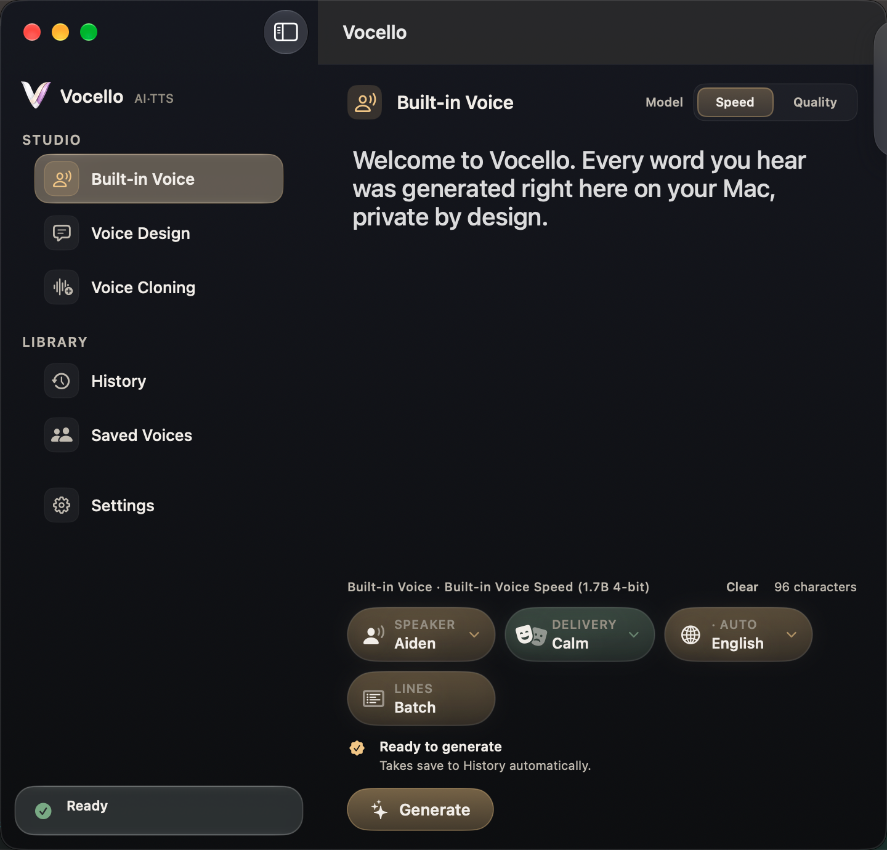
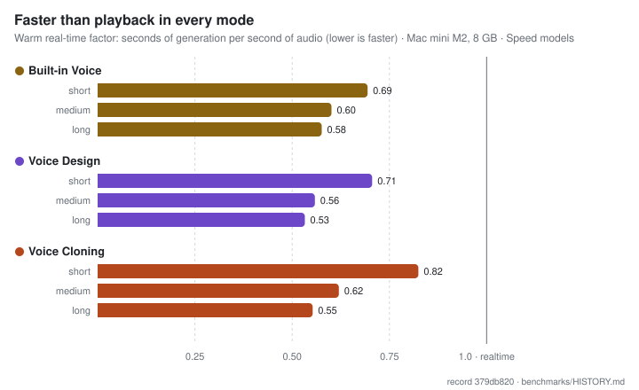
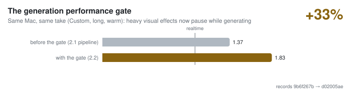
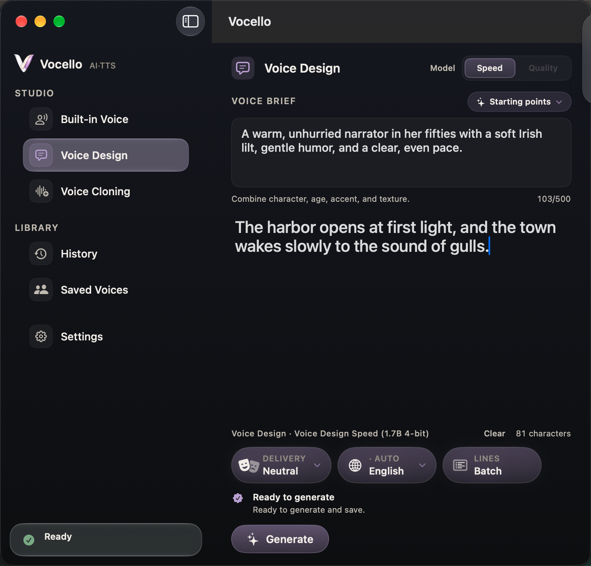
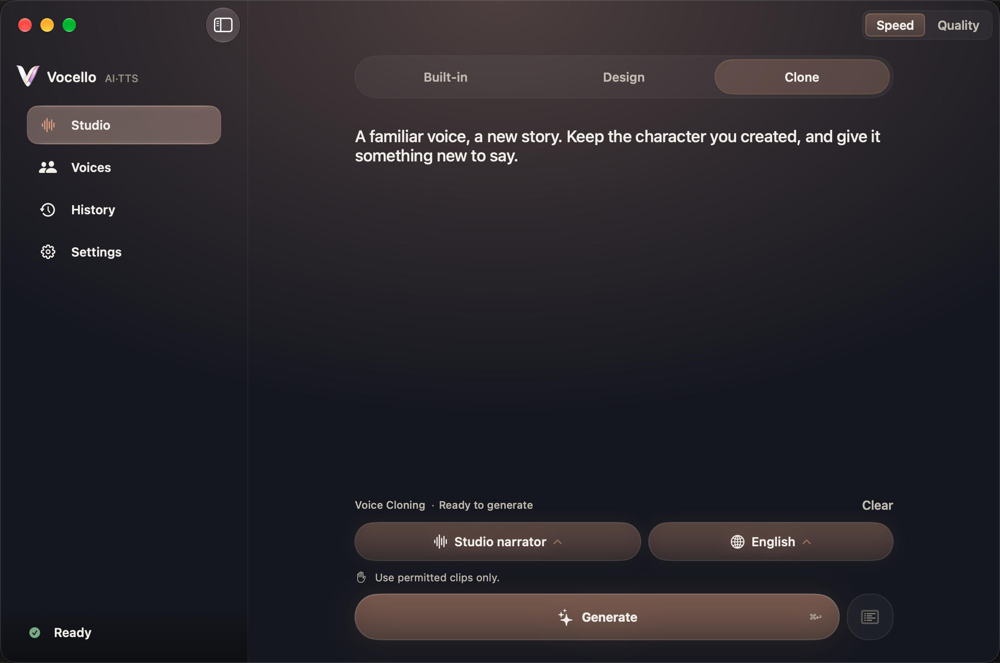
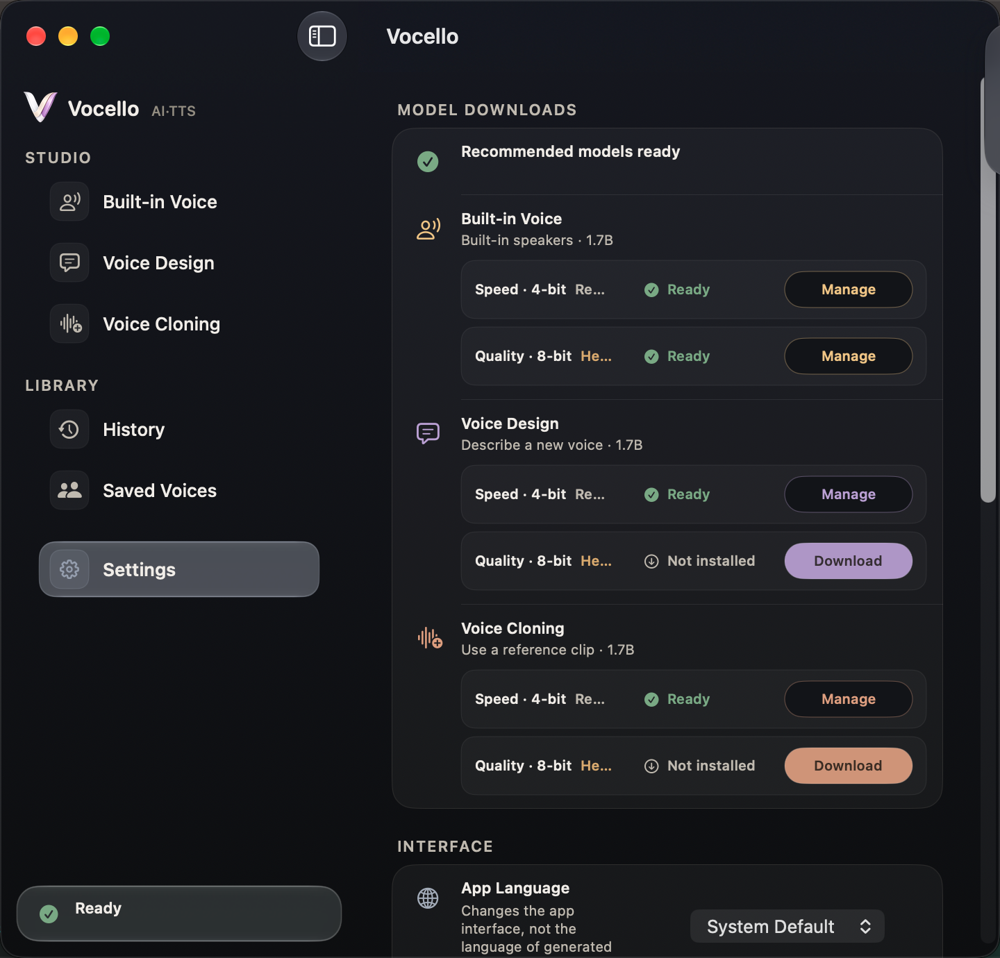
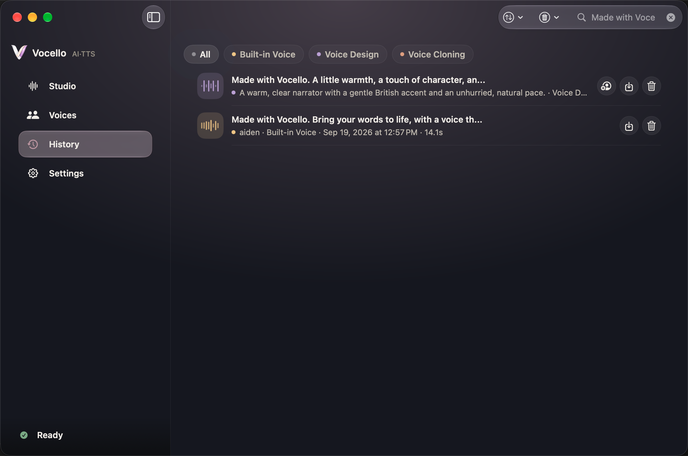
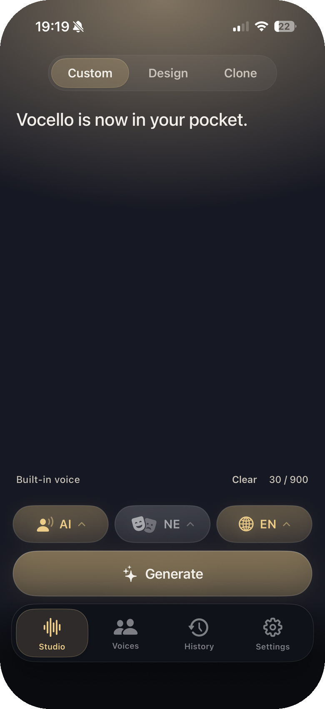
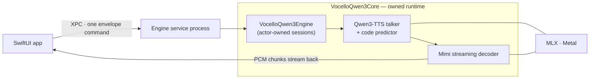
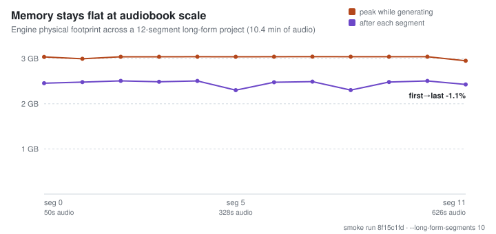

<h1 align="center">Vocello</h1>

<p align="center">
  A local, private voice studio for Apple Silicon. Write a script, choose or shape a voice, and generate speech on your device with native Swift and MLX.<br>
  <strong>Available for Mac. The iPhone app is implemented and awaiting public distribution.</strong>
</p>

<p align="center">
  <a href="https://vocello.vercel.app/"></a>
  <a href="https://github.com/PowerBeef/Vocello/releases/tag/v2.2.0"></a>
  
  
  
  <a href="LICENSE"></a>
</p>

<div align="center">


</div>

<p align="center">
  <a href="https://github.com/PowerBeef/Vocello/releases/download/v2.2.0/Vocello-macos26.dmg"><strong>Download Vocello 2.2.0 for macOS 26+</strong></a><br>
  <a href="https://github.com/PowerBeef/Vocello/releases/tag/v2.2.0">Release details</a> · <a href="docs/releases/v2.2.0.md">What is new</a> · <a href="https://github.com/PowerBeef/Vocello/releases">All releases</a>
</p>

<p align="center">
  <em>Write a script, pick or shape a voice, and listen — a native Swift + MLX engine, faster than realtime on an 8&nbsp;GB M2, with nothing leaving your Mac.</em>
</p>



## What Vocello does

- **Custom Voice:** choose one of nine built-in Qwen3 speakers, then set language and delivery.
- **Voice Design:** describe a voice in plain language and generate it from that brief.
- **Voice Cloning:** record or import a reference you have permission to use, affirm consent, and save it to your voice library.

Scripts past 900 characters become **long-form projects**: planned segments stream one after another while you listen along, then join into a single finished file with a per-segment map in History. Ten languages are supported (Chinese, English, Japanese, Korean, German, French, Russian, Portuguese, Spanish, and Italian) with automatic detection, and everything — scripts, references, history, audio — stays in local app storage unless you export it.

## Performance, measured

Every number below comes from a tracked, privacy-safe benchmark record in this repository — canonical evidence is produced on the support-floor tier, a Mac mini M2 with 8 GB.

<picture>
  <source media="(prefers-color-scheme: dark)" srcset="docs/charts/rtf-by-mode-dark.svg">
  
</picture>

Vocello 2.2 also changed how the app behaves *while* it generates: translucent interface surfaces temporarily render as solid fills so the compositor stops competing with the engine. Same machine, same take — about a third faster:

<picture>
  <source media="(prefers-color-scheme: dark)" srcset="docs/charts/gate-delta-dark.svg">
  
</picture>

The full methodology, hardware profiles, and every published record live in [`benchmarks/HISTORY.md`](benchmarks/HISTORY.md) and [`docs/reference/benchmarking-procedure.md`](docs/reference/benchmarking-procedure.md); the charts above regenerate deterministically from the named records via `scripts/generate_readme_charts.py`.

## Voice workflows

| Voice Design | Voice Cloning |
| --- | --- |
|  |  |
| Describe character, age, accent, texture, and delivery. Save a successful design as a reusable voice reference. | Record in the app or import WAV, MP3, AIFF, M4A, FLAC, OGG, or WebM. A transcript improves conditioning but is optional. Generation requires the visible consent acknowledgment in Settings; only clone voices you own or are authorized to use. |

Custom Voice and Voice Design support ten delivery styles at subtle, normal, or strong intensity, plus a free-text delivery description. Voice Cloning follows the reference voice and does not expose delivery controls.

| Models | History |
| --- | --- |
|  |  |
| Install and manage the available model package for each voice mode from Settings. | Generations remain local and can be replayed, searched, exported, or removed. |

## Install on Mac

1. Download [`Vocello-macos26.dmg`](https://github.com/PowerBeef/Vocello/releases/download/v2.2.0/Vocello-macos26.dmg).
2. Open the DMG and drag `Vocello.app` to `/Applications`.
3. Open Vocello, then install models from **Settings > Model downloads**.
4. Generate from Custom Voice, Voice Design, or Voice Cloning.

The current DMG is signed with an Apple Developer ID certificate, notarized, and stapled. No Python runtime or local server is required. The attached [`release-metadata.txt`](https://github.com/PowerBeef/Vocello/releases/download/v2.2.0/release-metadata.txt) records source and toolchain provenance.

Upgrading from Vocello 2.0 or 2.1 does not require reinstalling models. Application data remains under `~/Library/Application Support/QwenVoice/`.

With the 2.2.0 release the repository moved from `PowerBeef/QwenVoice` to `PowerBeef/Vocello`; every old link and clone URL redirects to the new name.

## System requirements and model variants

| Platform | Support | Model variants | Public status |
| --- | --- | --- | --- |
| Mac | macOS 26.0 or newer, Apple Silicon, 8 GB RAM minimum | Speed (4-bit) and Quality (8-bit) | Vocello 2.2.0 is available now |
| iPhone | iPhone 15 Pro or newer, iOS 26.0 or newer | Speed (4-bit) | App implemented; public distribution pending |

Speed is the recommended default and uses less memory. Quality is a Mac-only option for machines with more headroom. The three recommended Mac Speed packages total about 7 GB.

Support floors and benchmark machines are different facts: the floor is any Apple Silicon Mac with 8 GB, and canonical evidence is produced on a Mac mini M2 with 8 GB and an iPhone 17 Pro — see [Performance, measured](#performance-measured) above. The canonical record is `passedWithWarnings` because accepted memory soft trims and audio-QC warnings remain visible rather than being hidden; the [tracked record](benchmarks/runs/ui-generation/macos-xcui-benchmark-20260723-083313-d02005ae.json) has the exact matrix and conditions.

Macs on macOS 15 can use the legacy [QwenVoice 1.2.3 release](https://github.com/PowerBeef/Vocello/releases/tag/v1.2.3). No Vocello 2.x backport is planned.

## Variation and reproducibility

The Expressive, Balanced, and Consistent variation settings trade take-to-take variety against stability. Multi-line batches share one seed so their lines form a consistent performance. CLI and benchmark callers can provide an explicit seed for reproducible evidence. Ordinary interactive generations are not presented as seed-replayable takes.

## Local-first privacy

- Speech generation runs locally after models are installed.
- Generated audio, recorded references, transcripts, saved voices, and history remain in local app storage unless you export them.
- Model installation downloads pinned model artifacts from Hugging Face.
- Reference recording requests microphone access. Transcript auto-fill requests Speech Recognition access and uses on-device recognition with the required system language assets.
- Voice cloning should only be used with voices you own or have permission to use.
- Clone generation remains disabled until its visible consent acknowledgment is enabled in
  Settings; the choice is stored locally and can be changed there.

Storage locations and deletion behavior are documented in [`docs/reference/privacy-storage.md`](docs/reference/privacy-storage.md).

## Vocello for iPhone

| | |
| --- | --- |
|  | The iPhone app uses the same local Qwen3-TTS and MLX foundation with an iPhone-specific in-process runtime. It provides Custom Voice, Voice Design, Voice Cloning, recording and Files import, local history, and the memory-conscious Speed models. On-device generation, physical-iPhone XCUITest, and an optional signed archive/TestFlight lane are implemented. A fresh full multilingual physical-iPhone run passed all 19 hint/QC and 18 output gates with policy-accepted warnings; its exploratory record is excluded from clean performance trends. Public distribution still requires the maintainer-owned App Store Connect release process. |

Current implementation and acceptance status: [`docs/development-progress.md`](docs/development-progress.md).

## Under the hood

Vocello is not a wrapper around a Python server. Generation runs through a first-party Swift runtime, [`VocelloQwen3Core`](Packages/VocelloQwen3Core/README.md) — derived from `mlx-audio-swift` and specialized for Qwen3-TTS and the Mimi codec, with a fused code-predictor RoPE, per-generation sampler state, and a streaming audio decoder that overlaps the token loop.



On the Mac, model work lives in a separate XPC service process that retires when idle; on iPhone the same engine runs in-process. Either way the architecture is streaming end to end: audio crosses an actor-owned lossless channel chunk by chunk, every request carries its own seed and sampler state (takes are reproducible by construction), and cancellation is a typed, awaited operation — a cancelled take can never land in History.

That streaming design is why memory does not grow with output length. A long-form project generates each planned segment as an ordinary streaming take and then assembles the joined file in bounded blocks:

<picture>
  <source media="(prefers-color-scheme: dark)" srcset="docs/charts/longform-memory-dark.svg">
  
</picture>

Engine invariants, the request lifecycle, and the model-delivery contract are documented in [`docs/ARCHITECTURE.md`](docs/ARCHITECTURE.md); benchmark publication is PASS-only and privacy-allowlisted by design.

## Build from source

Building requires **full Xcode 26** on an Apple Silicon Mac running macOS 26 or newer — the
Command Line Tools alone are not enough, even for the CLI, because every product (app and
`vocello`) is a target of the generated Xcode project. If `xcodebuild` reports the active
developer directory is a Command Line Tools instance, point it at Xcode:
`sudo xcode-select -s /Applications/Xcode.app/Contents/Developer`. Validation scripts run with
the system `python3` (any currently supported Python version).

```sh
git clone https://github.com/PowerBeef/Vocello.git
cd Vocello
./scripts/regenerate_project.sh
./scripts/build.sh build
```

Repository scripts are the authoritative build and test interface. `project.yml` generates the Xcode project, so edit it instead of the generated project file. To work in Xcode after generation, open `QwenVoice.xcodeproj`.

Generated native output is governed by [`config/build-output-policy.json`](config/build-output-policy.json): persistent platform caches live under `build/cache/`, temporary builds under `build/scratch/`, evidence and current symbols under `build/artifacts/`, and distribution products under `build/dist/`. The same contract owns child-result retention and free-space floors for heavy lanes, so a low-space run stops before creating another partial cache or result. Do not introduce another DerivedData root or a source-local `.build` directory.

Inspect before deleting anything:

```sh
python3 scripts/build_output_policy.py status
scripts/clean_build_caches.sh --routine --dry-run
scripts/clean_build_caches.sh --prune-ui-results --dry-run
scripts/clean_build_caches.sh --compact-profile-failure <run-id> --dry-run
```

Status separates automatically eligible bytes from blocked evidence and explicit failed-profile reclamation. If only one persistent cache is stale, use `--cache macos`, `--cache ios`, `--cache packages`, or `--cache runtime` rather than `--aggressive`. See [`docs/reference/privacy-storage.md`](docs/reference/privacy-storage.md) for the exact retention and compaction rules.

The ordinary deterministic checks are:

```sh
./scripts/check_project_inputs.sh
scripts/macos_test.sh test
./scripts/build.sh build
./scripts/build_foundation_targets.sh ios
```

The iOS command compiles both the app and its standalone, app-host-free platform-policy XCTest
bundle for the physical-device SDK. It does not execute tests or require a connected phone. Xcode
26 does not support executing a tool-hosted, app-host-free XCTest bundle on a physical-device
destination, so this bundle is compile-only; physical runtime and UI acceptance use the explicit
device diagnostics and XCUITest lanes. The selected Xcode must still have matching iOS Platform
Support/runtime availability for `generic/platform=iOS`; the repository checks this before package
resolution and never downloads or runs a Simulator component automatically.

These checks are sufficient for normal commits, pull requests, and merges. XCUITest is explicit frontend acceptance: native macOS or a paired physical iPhone, never Simulator. Models, a phone, and UI evidence are not prerequisites for sharing development work.

Start with [`CONTRIBUTING.md`](CONTRIBUTING.md) for the human contribution flow. Maintainers and
Coding agents should also read [`CLAUDE.md`](CLAUDE.md). Deeper references:

- [`docs/development-progress.md`](docs/development-progress.md): current implementation checkpoint and open acceptance work
- [`docs/ARCHITECTURE.md`](docs/ARCHITECTURE.md): runtime topology and engine invariants
- [`docs/project-map.html`](docs/project-map.html): interactive feature, target, dependency, and workflow map
- [`docs/reference/testing-runbook.md`](docs/reference/testing-runbook.md): deterministic and explicit frontend test lanes
- [`docs/reference/benchmarking-procedure.md`](docs/reference/benchmarking-procedure.md): benchmark protocol and PASS-only publication

## Command-line tool

The source tree also builds `vocello`, a headless interface to the same local Swift and MLX engine. It is not included in the app download.

```sh
./scripts/build.sh cli
build/vocello modes
build/vocello speakers list
build/vocello models list
build/vocello custom --variant speed --text "The train left at dawn."
echo "Hello there." | build/vocello generate --variant speed --stream --json
```

The CLI supports single generation, mode shortcuts, batches, saved voices, speaker and model discovery, model installation, and benchmark matrices. Standard output is machine-readable; progress is written to standard error. See [`docs/reference/cli.md`](docs/reference/cli.md).

## Contributing

- Read [`CONTRIBUTING.md`](CONTRIBUTING.md) before opening a change.
- Report bugs and request features through [GitHub Issues](https://github.com/PowerBeef/Vocello/issues).
- Security-sensitive reports should use GitHub's [private security advisory form](https://github.com/PowerBeef/Vocello/security/advisories/new).

## License and acknowledgements

Vocello is available under the [MIT License](LICENSE).

The project builds on [Qwen3-TTS](https://github.com/QwenLM/Qwen3-TTS), [MLX](https://github.com/ml-explore/mlx), [mlx-audio-swift](https://github.com/Blaizzy/mlx-audio-swift), and [GRDB.swift](https://github.com/groue/GRDB.swift). Vocello owns the first-party [`VocelloQwen3Core`](Packages/VocelloQwen3Core/README.md) Swift package derived from `mlx-audio-swift` v0.1.2. Its immutable origin, preserved package compatibility, ownership boundary, current capabilities, and historical upstream deltas are tracked with the package.
